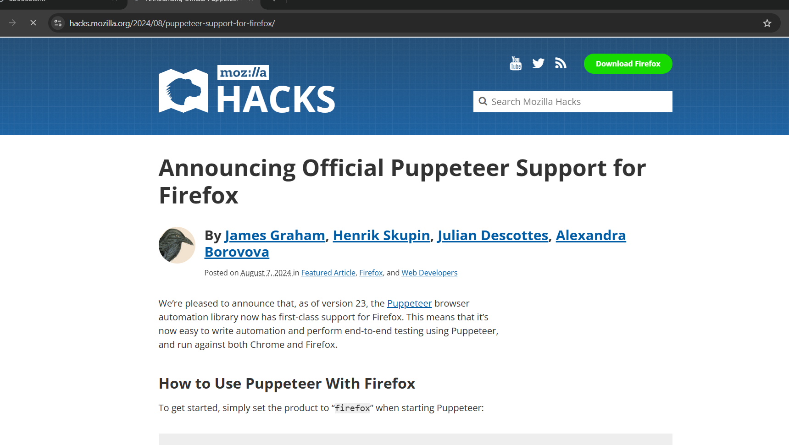
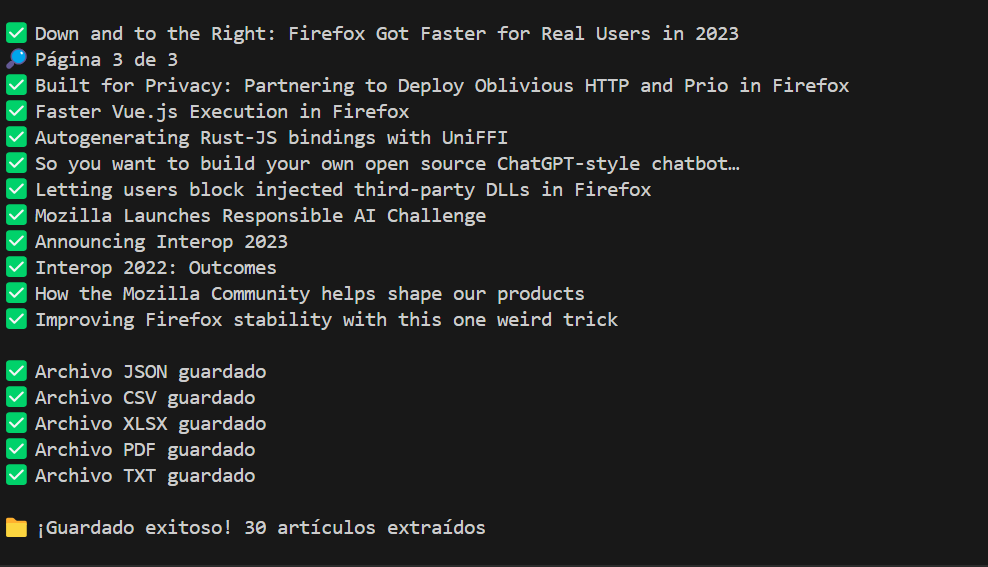

# Scrapping-Mozilla

Este proyecto es un scraper en Node.js que extrae los artículos del blog [Mozilla Hacks](https://hacks.mozilla.org/), obteniendo la información como título, autor, fecha, resumen y URL. Los datos se guardan automáticamente en varios formatos: JSON, CSV, XLSX, PDF y TXT.

## Instalación

1. Clona este repositorio o descarga los archivos.
2. Instala las dependencias ejecutando:

   ```sh
   npm install 
   npm i puppeteer
   ```

## Uso

Ejecuta el scraper con:

```sh
npm run start
```

Esto generará los archivos `articulos-mozilla.json`, `articulos-mozilla.csv`, `articulos-mozilla.xlsx`, `articulos-mozilla.pdf` y `articulos.txt` en la carpeta del proyecto.

## Captura de pantalla

```markdown



```

---

## Autores

- Gerardo Aristeo Morales Alejo. 
- Miguel Ignacio Gomez Portes. 
- Luis Ruben Carlos Rodriguez.
- Lesly Guadalupe Morales Cuellar.
